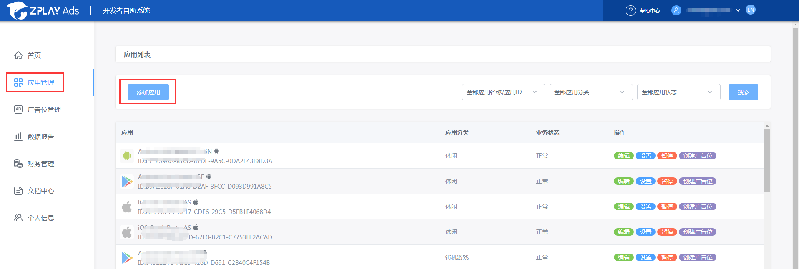
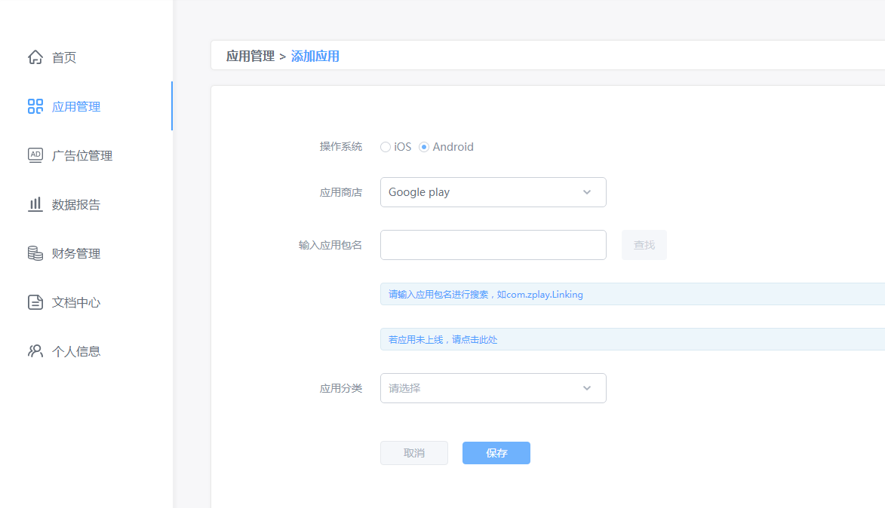
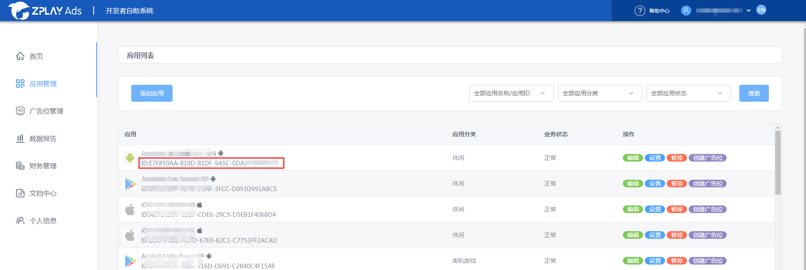
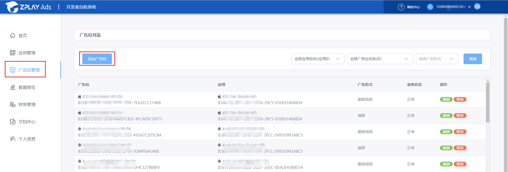
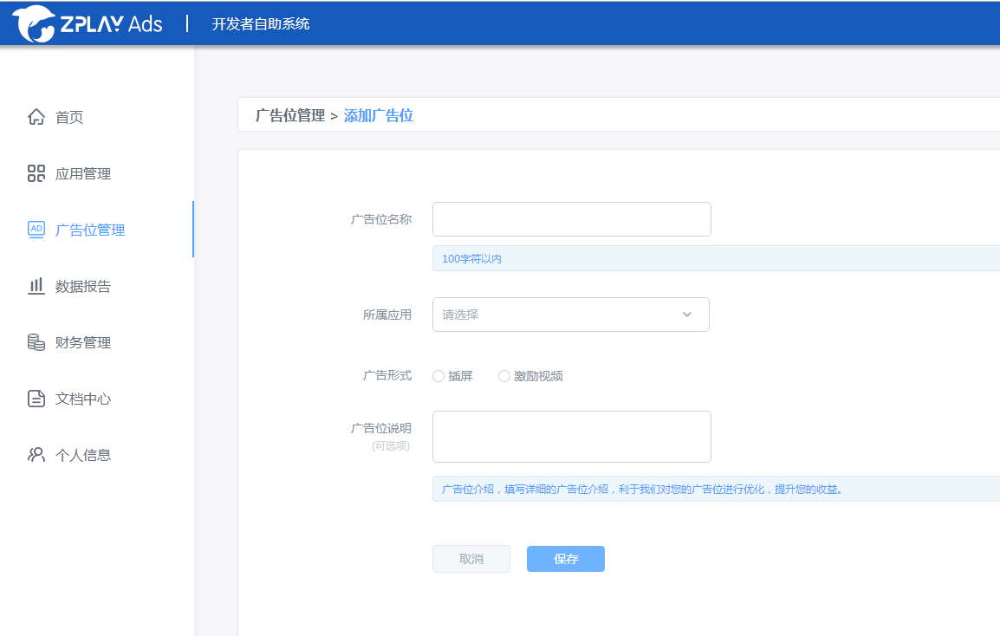
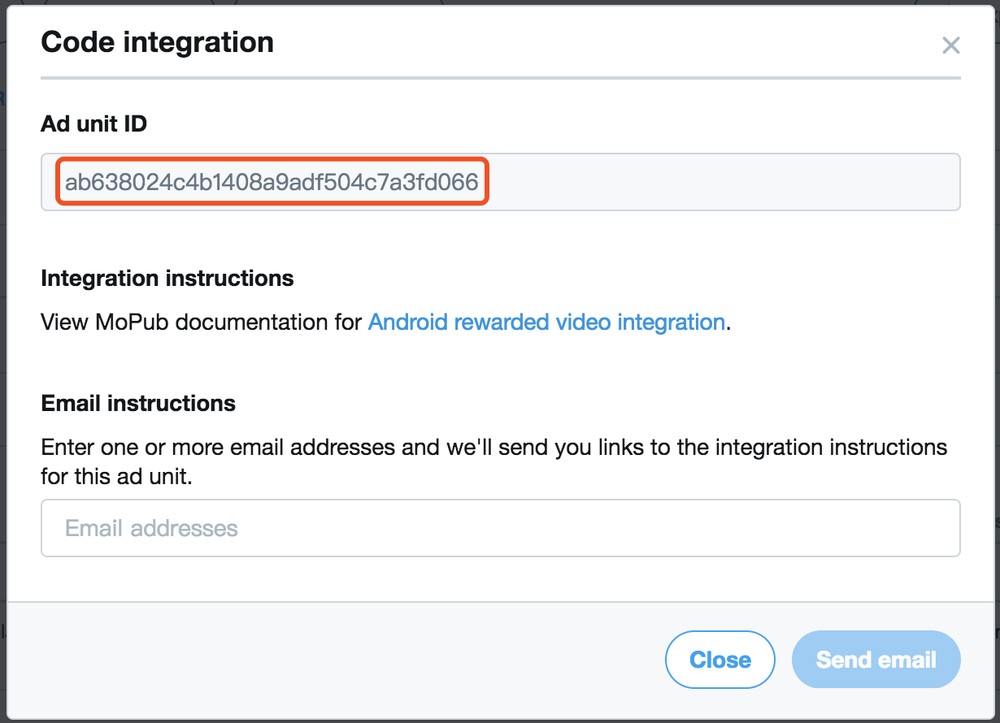
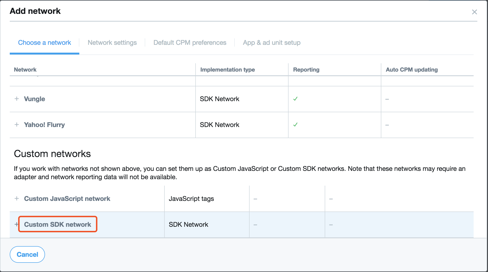
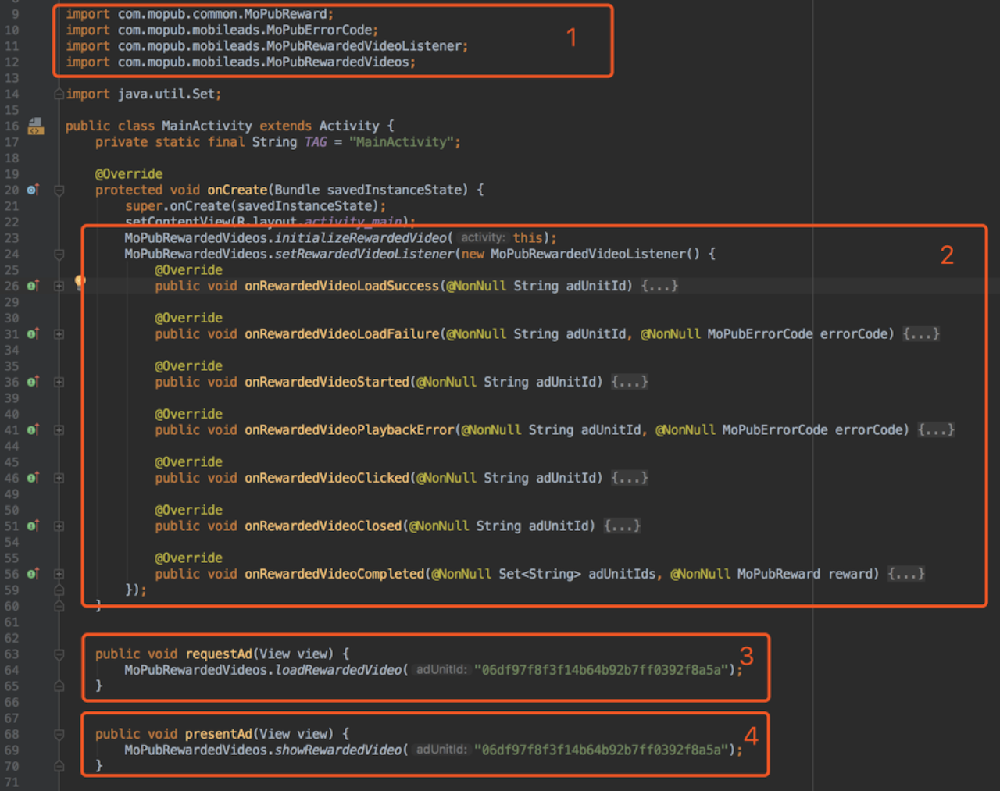

## 目录
1. 在可玩广告平台申请应用ID及广告位ID
2. 添加MoPub SDK和PlayableAds SDK
3. 将以下文件添加到工程里面 
4. 在MoPub平台为可玩广告配置广告位 
5. 在MoPub平台增加可玩广告为新的广告源 
6. 在MoPub平台打开可玩广告广告源 
7. 确认可玩广告配置成功 
8. 在工程中使用MoPub请求可玩广告 
9. 调试

---

## 1. 在可玩广告平台申请应用ID及广告位ID
### 1.1 进入“应用管理”页面，点击添加“添加应用”按钮


### 1.2 填写相关信息，点击“添加”按钮，返回应用管理列表页 


### 1.3 在应用管理列表页，获取应用的ID


### 1.4 点击应用右侧的“创建广告位”按钮或者进入“广告位管理页面”点击“添加广告位”按钮


### 1.5填写相关信息，点击“添加”按钮，返回广告位管理列表页


### 1.6在广告位管理列表页，获取广告位的ID


注：您在测试中可使用如下id进行测试，测试id不会产生收益，应用上线时请使用您申请的正式id。

|操作系统|  App_ID  |  Ad_Unit_id|
|--------|----------|------------|
|Android |5C5419C7-A2DE-88BC-A311-C3E7A646F6AF|3FBEFA05-3A8B-2122-24C7-A87D0BC9FEEC|

## 2. 添加MoPub SDK和PlayableAds SDK，步骤如下：
```
dependencies {
    ...
    // 可玩广告依赖
    compile 'com.playableads:playableads:2.0.1'
    // mopub广告依赖
    compile('com.mopub:mopub-sdk:4.16.0@aar') {
        transitive = true
    }
}
```
### 2.1 添加android工程依赖


### 2.2 在Manifest文件下添加MoPub使用到的组件
```
<application>
    <activity
        android:name="com.mopub.mobileads.MoPubActivity"
        android:configChanges="keyboardHidden|orientation|screenSize" />
    <activity
        android:name="com.mopub.mobileads.MraidActivity"
        android:configChanges="keyboardHidden|orientation|screenSize" />
    <activity
        android:name="com.mopub.common.MoPubBrowser"
        android:configChanges="keyboardHidden|orientation|screenSize" />
    <activity
        android:name="com.mopub.mobileads.MraidVideoPlayerActivity"
        android:configChanges="keyboardHidden|orientation|screenSize" />
    <activity
        android:name="com.mopub.mobileads.RewardedMraidActivity"
        android:configChanges="keyboardHidden|orientation|screenSize" />
</application>
```


## 3. 将以下文件添加到工程里面
[PlayableAdsRewardedVideo.java](app/src/main/java/com/zplay/playable/mediationmopub/PlayableAdsRewardedVideo.java)
确保导入相关的类之后没有错误提示，记录该文件包路径，例如：（com.zplay.playable.mediationmopub.PlayableAdsRewardedVideo），这个路径用于在MoPub平台配置playableAds信息。

## 4. 在MoPub平台为可玩广告配置广告位
### 4.1 为可玩广告新建广告位
- a. 进入应用，点击“new add unit”按钮


- b. 创建广告位，请注意format应该为Rewarded video，点击“save”按钮

 

- c. 获取新创建广告位的ad unit ID



### 4.2 获取已有广告位的ID
- a. 选择应用，进入广告位列表，选择要接入的广告位，点击进入。点击“edit ad unit”按钮，点击“view code integration”按钮


- b. 获取广告位的ad unit ID


## 5. 在MoPub平台增加可玩广告为新的广告源
### 5.1 进入“networks”页面，点击“add a network”按钮


### 5.2 点击“custom native network“链接


### 5.3 添加可玩广告平台名称为ZPLAY Ads android（图示1），并且在步骤3中申请的广告位中配置可玩广告（图示2和图示3）。


- a. 请在图示2的位置添加如下信息：
```
com.zplay.playable.mediationmopub.PlayableAdsRewardedVideo
```

注：(填写的是PlayableAdsRewardedVideo在项目中实际的位置)
```
{
    "APPID": "androidDemoApp",
    "AdUnitId": "androidDemoAdUnit"
}
```
- b. 请在图示3的位置添加在可玩广告平台申请的广告位信息，格式如下：
注意：将androidDemoApp替换成您在可玩广告平台申请的APPID（步骤1.3），将androidDemoAdUnit替换成您在可玩广告平台申请的AdUnitId（步骤1.6）。

## 6. 在MoPub平台打开可玩广告广告源
### 6.1 进入“segments”页面，点击“Global Segment”链接


### 6.2 找到接入可玩广告的应用（如示例中MediationMopub）及广告位（示例中的新可玩广告），打开可玩广告广告源（图中的turn on所示的按钮）


## 7. 确认可玩广告配置成功
进入6.2 中已经打开可玩广告源的广告位管理页面，如果成功配置，则会在ad sources列表中会显示如下信息。如果未显示，请参照以上步骤进行检查。


## 8. 在工程中使用MoPub请求可玩广告
配置信息如下：



图示1：导入MoPub需要的文件
图示2：初始化MoPub SDK
图示3：请求广告，请正确填入在MoPub平台申请的广告位ID（详见第4步）
图示4：展示广告，请正确填入在MoPub平台申请的广告位ID（详见第4步）

## 9. 调试
查看MoPubRewardedVideoListener回调中的信息，可判断是否加载成功，以及定位问题。


